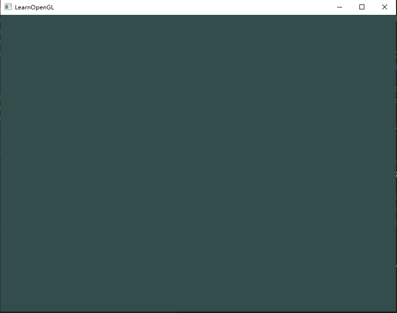
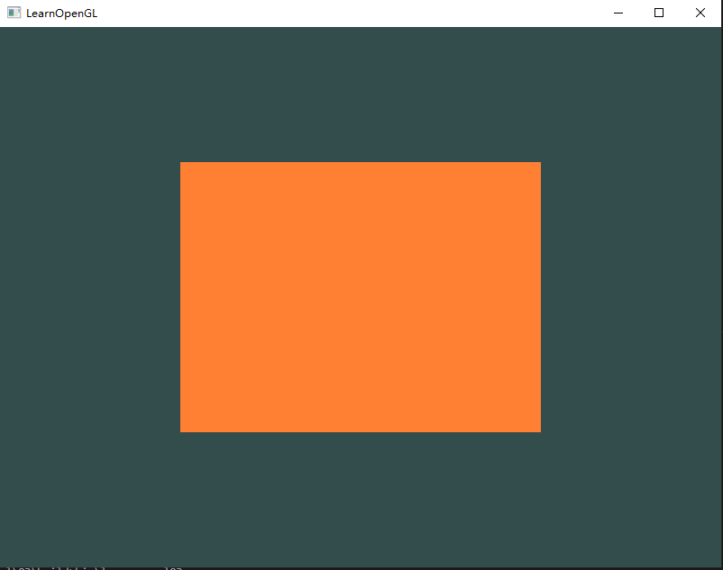
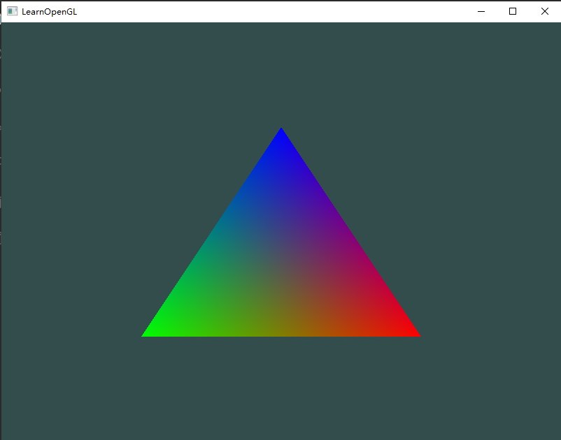

# LearnOpenGL

## Compiling steps

1. Create conanfile.txt
   
   
query the required libs: 
[https://conan.io/center/](https://conan.io/center/)

```
[requires]
glfw/3.3.2
glad/0.1.34

[generators]
cmake
```


2. Create a build directory:

    ```
    $ mkdir build && cd build
    ```

3. Install dependencies (glfw -> glad -> opengl):

    ```
    $ conan install ..
    ```

4. Configure the CMake project (Using MSVC 16 in this example):

    ```
    $ cmake .. -G "Visual Studio 16 2019"
    ```

5. Build it:

    ```
    $ cmake --build . --config Release
    ```

6. Run the application:

    ```
    $ .\bin\learnopengl01.exe
    ```

## 01

[你好，窗口](https://learnopengl-cn.github.io/01%20Getting%20started/03%20Hello%20Window/)



## 02

[你好，三角形](https://learnopengl-cn.github.io/01%20Getting%20started/04%20Hello%20Triangle/)



## 03

[着色器](https://learnopengl-cn.github.io/01%20Getting%20started/05%20Shaders/)


